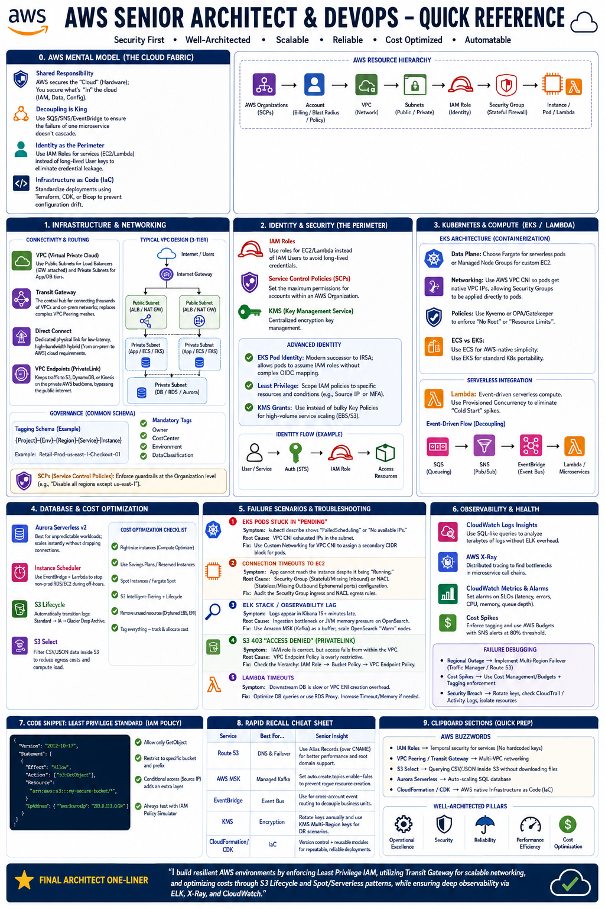

# 🚀 AWS Senior Architect & DevOps README



### 📘 Quick Reference (The Resource Hierarchy)

```text
AWS Organizations (SCPs) 
  ↳ Account (Billing/Blast Radius/Policy) 
    ↳ VPC (Network) → Subnets (Public/Private)
      ↳ IAM Role (Identity) → Security Group (Stateful Firewall)
        ↳ Instance / Pod / Lambda
```

---

# 🧠 0. AWS Mental Model (The Cloud Fabric)

* **Shared Responsibility:** AWS secures the "Cloud" (Hardware); You secure what's "In" the cloud (IAM, Data, Config).
* **Decoupling is King:** Use SQS/SNS/EventBridge to ensure the failure of one microservice doesn't cascade.
* **Identity as the Perimeter:** Use IAM Roles for services (EC2/Lambda) instead of long-lived User keys to eliminate credential leakage.
* **Infrastructure as Code (IaC):** Standardize deployments using **Terraform, CDK, or Bicep** to prevent configuration drift.

---

# ⚙️ 1. Infrastructure & Networking

### 🔑 Connectivity & Routing
* **VPC (Virtual Private Cloud):** Use **Public Subnets** for Load Balancers (IGW attached) and **Private Subnets** for App/DB tiers.
* **Transit Gateway:** The central hub for connecting thousands of VPCs and on-prem networks; replaces complex VPC Peering meshes.
* **Direct Connect:** Dedicated physical link for low-latency, high-bandwidth hybrid (from on-prem to AWS) cloud requirements.
* **VPC Endpoints (PrivateLink):** Keeps traffic to S3, DynamoDB, or Kinesis on the private AWS backbone, bypassing the public internet.

### 🔑 Governance (Common Schema)
* **Tagging Schema:** `{Project}-{Env}-{Region}-{Service}-{Instance}`.
* **Mandatory Tags:** `Owner`, `CostCenter`, `Environment`, `DataClassification`.
* **SCPs (Service Control Policies):** Enforce guardrails at the Organization level (e.g., "Disable all regions except us-east-1").

---

# 🔐 2. Identity & Security (The Perimeter)
###
* **IAM Roles**: Use roles for EC2/Lambda instead of IAM Users to avoid long-lived credentials.
* **Service Control Policies (SCPs)**: Set the maximum permissions for accounts within an AWS Organization.
* **KMS (Key Management Service)**: Centralized encryption key management.
### 🔑 Advanced Identity
* **EKS Pod Identity:** The modern successor to IRSA; allows pods to assume IAM roles without complex OIDC mapping.
* **Least Privilege:** Always scope IAM policies to specific resources and conditions (e.g., Source IP or MFA).
* **KMS (Key Management):** Use **KMS Grants** instead of bulky Key Policies for high-volume service scaling (EBS/S3).

---

# ⚡ 3. Kubernetes & Compute (EKS/Lambda Focus)
### 🔑 EKS Architecture (Containerization)
* **Data Plane:** Choose **Fargate** for serverless pods or **Managed Node Groups** for custom EC2 requirements.
* **Networking:** Use **AWS VPC CNI** so pods get native VPC IPs, allowing Security Groups to be applied directly to pods.
* **Policies:** Use **Kyverno** or **OPA/Gatekeeper** to enforce "No Root" or "Resource Limits".
* **ECS vs EKS:** Use ECS for AWS-native simplicity; use EKS for standard K8s portability.

### 🔑 Serverless Integration
* **Lambda:** Event-driven serverless compute. Use **Provisioned Concurrency** to eliminate "Cold Start" spikes.
* **Event-Driven Flow:** **SQS** (Queueing/Buffering), **SNS** (Pub/Sub fan-out), and **EventBridge** (Schema-aware event bus) for decoupling microservices.

---

# 💰 4. Database & Cost Optimization

* **Aurora Serverless v2:** Best for unpredictable workloads; scales instantly without dropping connections.
* **Instance Scheduler:** Use EventBridge + Lambda to stop non-prod RDS/EC2 during off-hours.
* **S3 Lifecycle:** Automatically transition logs: `Standard → IA → Glacier Deep Archive`.
* **S3 Select:** Filter CSV/JSON data *inside* S3 to reduce egress costs and compute load.

---

# 🚨 5. Failure Scenarios & Troubleshooting

### 🔥 1. EKS Pods Stuck in "Pending"
* **Symptom:** `kubectl describe` shows "FailedScheduling" or "No available IPs."
* **Root Cause:** VPC CNI exhausted IPs in the subnet.
* **Fix:** Use **Custom Networking** for VPC CNI to assign a secondary CIDR block for pods.

### 🔥 2. Connection Timeouts to EC2
* **Symptom:** App cannot reach the instance despite it being "Running."
* **Root Cause:** **Security Group** (Stateful/Missing Inbound) or **NACL** (Stateless/Missing Outbound Ephemeral ports) configuration.
* **Fix:** Audit the Security Group ingress and NACL egress rules.

### 🔥 3. ELK Stack / Observability Lag
* **Symptom:** Logs appear in Kibana 15+ minutes late.
* **Root Cause:** Ingestion bottleneck or JVM memory pressure on OpenSearch.
* **Fix:** Use **Amazon MSK (Kafka)** as a buffer; scale OpenSearch "Warm" nodes.

### 🔥 4. S3 403 "Access Denied" (PrivateLink)
* **Symptom:** IAM role is correct, but access fails from within the VPC.
* **Root Cause:** VPC Endpoint Policy is overly restrictive.
* **Fix:** Check the hierarchy: `IAM Role → Bucket Policy → VPC Endpoint Policy`.

### 🔥 5. Lambda Timeout 
* **Symptom:** Downstream DB is slow or VPC ENI creation overhead.
* **Fix:** Optimize DB queries or use RDS Proxy.
---

# 📊 6. Observability & Health

* **CloudWatch Logs Insights:** Use SQL-like queries to analyze terabytes of logs without ELK overhead.
* **AWS X-Ray:** Distributed tracing to find bottlenecks in microservice call chains.
* **Cost Spikes:** Enforce tagging and use **AWS Budgets** with SNS alerts at 80% threshold.

---
#### **Failure Debugging**
```markdown
- Regional Outage → Implement Multi-Region Failover (Traffic Manager / Route 53)
- Cost Spikes → Use Cost Management/Budgets + Tagging enforcement
- Security Breach → Rotate keys, check CloudTrail/Activity Logs, isolate resources
```
---
### 💻 Code Snippet: The "Least Privilege" Standard

```json
{
  "Version": "2012-10-17",
  "Statement": [
    {
      "Effect": "Allow",
      "Action": ["s3:GetObject"],
      "Resource": "arn:aws:s3:::my-secure-bucket/*",
      "Condition": { 
        "IpAddress": { "aws:SourceIp": "203.0.113.0/24" } 
      }
    }
  ]
}
```

---

# 📎 Appendix: Rapid Recall Cheat Sheet

| Service | Best For... | Senior Insight |
| :--- | :--- | :--- |
| **Route 53** | DNS & Failover | Use **Alias Records** (over CNAME) for better performance and root domain support. |
| **AWS MSK** | Managed Kafka | Set `auto.create.topics.enable=false` to prevent rogue resource creation. |
| **EventBridge** | Event Bus | Use for cross-account event routing to decouple business units. |
| **KMS** | Encryption | Rotate keys annually and use **KMS Multi-Region keys** for DR scenarios. |

### 📎 Clipboard Sections (Quick Preparation)

#### **AWS Buzzwords**
```markdown
- IAM Roles → Temporal security for services (No hardcoded keys)
- VPC Peering / Transit Gateway → Multi-VPC networking
- S3 Select → Querying CSV/JSON inside S3 without downloading files
- Aurora Serverless → Auto-scaling SQL database
- CloudFormation / CDK → AWS native Infrastructure as Code (IaC)
```
---

# 🎯 Final Architect One-Liner
> "I build resilient AWS environments by enforcing **Least Privilege IAM**, utilizing **Transit Gateway** for scalable networking, and optimizing costs through **S3 Lifecycle** and **Spot/Serverless** patterns, while ensuring deep observability via **ELK, X-Ray, and CloudWatch**."
