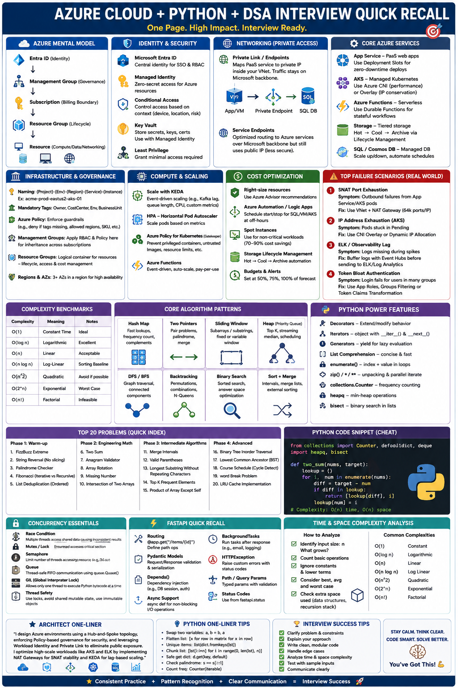

# Algorithm Complexity Analysis (Python Solutions Guide)


This document provides **questions, logic, implementations, and Big O analysis** for a 20-problem set.  
Designed for high-level engineering assessments (e.g., Crossover-style tests).

---

## 🚀 Key Benchmarks

| Complexity | Meaning | Notes |
|-----------|--------|------|
| **O(1)** | Constant time | Ideal |
| **O(n)** | Linear time | Acceptable |
| **O(n log n)** | Log-linear | Sorting baseline |
| **O(n²)** | Quadratic | Avoid when possible |

---

# 🧩 Solutions & Analysis

---

# Phase 1: The Warm-up

---

## 1. FizzBuzz Extreme

**Question:**  
Print numbers 1–100:
- Multiples of 3 → "Fizz"  
- Multiples of 5 → "Buzz"  
- Both → "FizzBuzz"  
- If number is prime → "Prime"

**Logic:**  
- Use modulo checks  
- Use helper function for prime detection  

```python
def is_prime(n):
    if n < 2: return False
    for i in range(2, int(n**0.5) + 1):
        if n % i == 0: return False
    return True

for i in range(1, 101):
    if is_prime(i): print("Prime")
    elif i % 15 == 0: print("FizzBuzz")
    elif i % 3 == 0: print("Fizz")
    elif i % 5 == 0: print("Buzz")
    else: print(i)
````

**Time Complexity:** O(n √m)
**Space Complexity:** O(1)

---

## 2. String Reversal (No slicing)

**Question:** Reverse a string without using `[::-1]`.

**Logic:**

* Build result string from front insertion

```python
def reverse_str(s):
    res = ""
    for char in s:
        res = char + res
    return res
```

**Time Complexity:** O(n)
**Space Complexity:** O(n)

---

## 3. Palindrome Checker

**Question:** Check if a string is a palindrome (ignore case & non-alphanumeric).

**Logic:**

* Filter string
* Use two-pointer comparison

```python
def is_palindrome(s):
    clean = "".join(char.lower() for char in s if char.isalnum())
    left, right = 0, len(clean) - 1

    while left < right:
        if clean[left] != clean[right]:
            return False
        left += 1
        right -= 1

    return True
```

**Time Complexity:** O(n)
**Space Complexity:** O(n)

---

## 4. Fibonacci (Iterative vs Recursive)

**Question:** Find nth Fibonacci number using both approaches.

**Logic:**

* Iterative → loop
* Recursive → repeated calls

```python
# Iterative
def fib_iter(n):
    a, b = 0, 1
    for _ in range(n):
        a, b = b, a + b
    return a

# Recursive
def fib_recur(n):
    if n <= 1: return n
    return fib_recur(n-1) + fib_recur(n-2)
```

**Iterative Complexity:**

* Time: O(n)
* Space: O(1)

**Recursive Complexity:**

* Time: O(2^n) ❌
* Space: O(n)

---

## 5. List Deduplication (Ordered)

**Question:** Remove duplicates while preserving order.

**Logic:**

* Use set to track seen elements

```python
def dedupe(items):
    seen = set()
    return [x for x in items if not (x in seen or seen.add(x))]
```

**Time Complexity:** O(n)
**Space Complexity:** O(n)

---

# Phase 2: Engineering Math

---

## 6. Two Sum

**Question:** Return indices of two numbers that sum to target.

**Logic:**

* Hash map stores complement

```python
def two_sum(nums, target):
    lookup = {}
    for i, num in enumerate(nums):
        diff = target - num
        if diff in lookup:
            return [lookup[diff], i]
        lookup[num] = i
```

**Time Complexity:** O(n)
**Space Complexity:** O(n)

---

## 7. Anagram Validator

**Question:** Check if two strings are anagrams.

**Logic:**

* Compare character frequencies

```python
from collections import Counter

def is_anagram(s1, s2):
    return Counter(s1) == Counter(s2)
```

**Time Complexity:** O(n)
**Space Complexity:** O(1)

---

## 8. Array Rotation

**Question:** Rotate array right by k steps.

**Logic:**

* Use slicing

```python
def rotate(nums, k):
    k = k % len(nums)
    nums[:] = nums[-k:] + nums[:-k]
```

**Time Complexity:** O(n)
**Space Complexity:** O(n)

---

## 9. Missing Number

**Question:** Find missing number in range [0, n].

**Logic:**

* Use sum formula

```python
def missing_number(nums):
    n = len(nums)
    return n * (n + 1) // 2 - sum(nums)
```

**Time Complexity:** O(n)
**Space Complexity:** O(1)

---

## 10. Intersection of Two Arrays

**Question:** Find unique intersection.

**Logic:**

* Use set intersection

```python
def intersection(a, b):
    return list(set(a) & set(b))
```

**Time Complexity:** O(n + m)
**Space Complexity:** O(n + m)

---

# Phase 3: Intermediate Algorithms

---

## 11. Merge Intervals

**Question:** Merge overlapping intervals.

**Logic:**

* Sort + merge

```python
def merge_intervals(intervals):
    intervals.sort(key=lambda x: x[0])
    merged = []

    for current in intervals:
        if not merged or merged[-1][1] < current[0]:
            merged.append(current)
        else:
            merged[-1][1] = max(merged[-1][1], current[1])

    return merged
```

**Time Complexity:** O(n log n)
**Space Complexity:** O(n)

---

## 12. Valid Parentheses

**Question:** Check if brackets are valid.

**Logic:**

* Stack-based matching

```python
def is_valid(s):
    stack = []
    mapping = {")": "(", "}": "{", "]": "["}

    for char in s:
        if char in mapping:
            top = stack.pop() if stack else '#'
            if mapping[char] != top:
                return False
        else:
            stack.append(char)

    return not stack
```

**Time Complexity:** O(n)
**Space Complexity:** O(n)

---

## 13. Maximum Subarray (Kadane’s Algorithm)

**Question:** Find max subarray sum.

**Logic:**

* Track running sum

```python
def max_subarray(nums):
    cur_sum = max_sum = nums[0]
    for x in nums[1:]:
        cur_sum = max(x, cur_sum + x)
        max_sum = max(max_sum, cur_sum)
    return max_sum
```

**Time Complexity:** O(n)
**Space Complexity:** O(1)

---

## 14. Best Time to Buy/Sell Stock

**Question:** Max profit from one transaction.

**Logic:**

* Track min price and profit

```python
def max_profit(prices):
    min_price = float('inf')
    profit = 0

    for p in prices:
        min_price = min(min_price, p)
        profit = max(profit, p - min_price)

    return profit
```

**Time Complexity:** O(n)
**Space Complexity:** O(1)

---

## 15. Matrix Transpose

**Question:** Transpose matrix.

**Logic:**

* Swap rows/columns

```python
def transpose(matrix):
    return [[row[i] for row in matrix] for i in range(len(matrix[0]))]
```

**Time Complexity:** O(n × m)
**Space Complexity:** O(n × m)

---

# Phase 4: Python Proficiency & OOP

---

## 16. Timer Decorator

**Question:** Measure function execution time.

**Logic:**

* Wrap function

```python
import time

def timer(func):
    def wrapper(*args, **kwargs):
        start = time.time()
        result = func(*args, **kwargs)
        print(f"{func.__name__} took {time.time() - start:.4f}s")
        return result
    return wrapper
```

**Time Complexity:** O(1) overhead

---

## 17. Custom Reverse Iterator

**Question:** Iterate list in reverse.

**Logic:**

* Implement iterator protocol

```python
class ReverseIter:
    def __init__(self, data):
        self.data = data
        self.index = len(data)

    def __iter__(self):
        return self

    def __next__(self):
        if self.index == 0:
            raise StopIteration
        self.index -= 1
        return self.data[self.index]
```

**Time Complexity:** O(1) per operation
**Space Complexity:** O(1)

---

## 18. Flatten Nested List

**Question:** Flatten nested lists.

**Logic:**

* Recursive generator

```python
def flatten(nested):
    for i in nested:
        if isinstance(i, list):
            yield from flatten(i)
        else:
            yield i
```

**Time Complexity:** O(N)
**Space Complexity:** O(D)

---

## 19. LRU Cache

**Question:** Implement LRU cache.

**Logic:**

* Hash map + doubly linked list

```python
class Node:
    def __init__(self, key, value):
        self.key = key
        self.value = value
        self.prev = None
        self.next = None

class LRUCache:
    def __init__(self, capacity):
        self.capacity = capacity
        self.cache = {}

        self.head = Node(0, 0)
        self.tail = Node(0, 0)
        self.head.next = self.tail
        self.tail.prev = self.head

    def _remove(self, node):
        node.prev.next = node.next
        node.next.prev = node.prev

    def _add(self, node):
        node.next = self.head.next
        node.prev = self.head
        self.head.next.prev = node
        self.head.next = node

    def get(self, key):
        if key in self.cache:
            node = self.cache[key]
            self._remove(node)
            self._add(node)
            return node.value
        return -1

    def put(self, key, value):
        if key in self.cache:
            self._remove(self.cache[key])

        node = Node(key, value)
        self._add(node)
        self.cache[key] = node

        if len(self.cache) > self.capacity:
            lru = self.tail.prev
            self._remove(lru)
            del self.cache[lru.key]
```

**Time Complexity:** O(1)
**Space Complexity:** O(n)

---

## 20. Singleton Pattern

**Question:** Ensure only one instance exists.

**Logic:**

* Override `__new__`

```python
class Singleton:
    _instance = None

    def __new__(cls):
        if cls._instance is None:
            cls._instance = super().__new__(cls)
        return cls._instance
```

**Time Complexity:** O(1)

---

# ✅ Final Notes

* Use **hash maps** for fast lookups
* Avoid **nested loops**
* Prefer **iterative over recursive** when exponential
* Focus on **clarity + efficiency**

---

# 📌 Summary

This guide includes:

* Questions
* Logic
* Implementations
* Complexity analysis

Perfect for:

* Coding interviews
* Engineering assessments
* Algorithm revision

```
```

### 1. FizzBuzz Extreme

```python
def is_prime(n):
    if n < 2: return False
    for i in range(2, int(n**0.5) + 1):
        if n % i == 0: return False
    return True

for i in range(1, 101):
    if is_prime(i): print("Prime")
    elif i % 15 == 0: print("FizzBuzz")
    elif i % 3 == 0: print("Fizz")
    elif i % 5 == 0: print("Buzz")
    else: print(i)
````

* **Time:** O(n √m)
* **Space:** O(1)

---

### 2. String Reversal (No slicing)

```python
def reverse_str(s):
    res = ""
    for char in s:
        res = char + res
    return res
```

* **Time:** O(n)
* **Space:** O(n)

---

### 3. Palindrome Checker

```python
def is_palindrome(s):
    clean = "".join(char.lower() for char in s if char.isalnum())
    left, right = 0, len(clean) - 1

    while left < right:
        if clean[left] != clean[right]:
            return False
        left += 1
        right -= 1

    return True
```

* **Time:** O(n)
* **Space:** O(n)

---

### 4. Fibonacci (Iterative vs Recursive)

```python
# Iterative
def fib_iter(n):
    a, b = 0, 1
    for _ in range(n):
        a, b = b, a + b
    return a

# Recursive
def fib_recur(n):
    if n <= 1: return n
    return fib_recur(n-1) + fib_recur(n-2)
```

* **Iterative:** O(n) time | O(1) space
* **Recursive:** O(2ⁿ) time | O(n) space ❌ Avoid

---

### 5. List Deduplication (Ordered)

```python
def dedupe(items):
    seen = set()
    return [x for x in items if not (x in seen or seen.add(x))]
```

* **Time:** O(n)
* **Space:** O(n)

---

## Phase 2: Engineering Math

### 6. Two Sum

```python
def two_sum(nums, target):
    lookup = {}
    for i, num in enumerate(nums):
        diff = target - num
        if diff in lookup:
            return [lookup[diff], i]
        lookup[num] = i
```

* **Time:** O(n)
* **Space:** O(n)

---

### 7. Anagram Validator

```python
from collections import Counter

def is_anagram(s1, s2):
    return Counter(s1) == Counter(s2)
```

* **Time:** O(n)
* **Space:** O(1)

---

### 8. Array Rotation

```python
def rotate(nums, k):
    k = k % len(nums)
    nums[:] = nums[-k:] + nums[:-k]
```

* **Time:** O(n)
* **Space:** O(n)

---

### 9. Missing Number

```python
def missing_number(nums):
    n = len(nums)
    return n * (n + 1) // 2 - sum(nums)
```

* **Time:** O(n)
* **Space:** O(1)

---

### 10. Intersection of Two Arrays

```python
def intersection(a, b):
    return list(set(a) & set(b))
```

* **Time:** O(n + m)
* **Space:** O(n + m)

---

## Phase 3: Intermediate Algorithms

### 11. Merge Intervals

```python
def merge_intervals(intervals):
    intervals.sort(key=lambda x: x[0])
    merged = []

    for current in intervals:
        if not merged or merged[-1][1] < current[0]:
            merged.append(current)
        else:
            merged[-1][1] = max(merged[-1][1], current[1])

    return merged
```

* **Time:** O(n log n)
* **Space:** O(n)

---

### 12. Valid Parentheses

```python
def is_valid(s):
    stack = []
    mapping = {")": "(", "}": "{", "]": "["}

    for char in s:
        if char in mapping:
            top = stack.pop() if stack else '#'
            if mapping[char] != top:
                return False
        else:
            stack.append(char)

    return not stack
```

* **Time:** O(n)
* **Space:** O(n)

---

### 13. Maximum Subarray (Kadane’s Algorithm)

```python
def max_subarray(nums):
    cur_sum = max_sum = nums[0]
    for x in nums[1:]:
        cur_sum = max(x, cur_sum + x)
        max_sum = max(max_sum, cur_sum)
    return max_sum
```

* **Time:** O(n)
* **Space:** O(1)

---

### 14. Best Time to Buy/Sell Stock

```python
def max_profit(prices):
    min_price = float('inf')
    profit = 0

    for p in prices:
        min_price = min(min_price, p)
        profit = max(profit, p - min_price)

    return profit
```

* **Time:** O(n)
* **Space:** O(1)

---

### 15. Matrix Transpose

```python
def transpose(matrix):
    return [[row[i] for row in matrix] for i in range(len(matrix[0]))]
```

* **Time:** O(n × m)
* **Space:** O(n × m)

---

## Phase 4: Python Proficiency & OOP

---

### 16. Timer Decorator

```python
import time

def timer(func):
    def wrapper(*args, **kwargs):
        start = time.time()
        result = func(*args, **kwargs)
        print(f"{func.__name__} took {time.time() - start:.4f}s")
        return result
    return wrapper
```

* **Overhead:** O(1)

---

### 17. Custom Reverse Iterator

```python
class ReverseIter:
    def __init__(self, data):
        self.data = data
        self.index = len(data)

    def __iter__(self):
        return self

    def __next__(self):
        if self.index == 0:
            raise StopIteration
        self.index -= 1
        return self.data[self.index]
```

* **Time:** O(1) per operation
* **Space:** O(1)

---

### 18. Flatten Nested List

```python
def flatten(nested):
    for i in nested:
        if isinstance(i, list):
            yield from flatten(i)
        else:
            yield i
```

* **Time:** O(N)
* **Space:** O(D)

---

### 19. LRU Cache (O(1) Operations)

```python
class Node:
    def __init__(self, key, value):
        self.key = key
        self.value = value
        self.prev = None
        self.next = None

class LRUCache:
    def __init__(self, capacity):
        self.capacity = capacity
        self.cache = {}

        self.head = Node(0, 0)
        self.tail = Node(0, 0)
        self.head.next = self.tail
        self.tail.prev = self.head

    def _remove(self, node):
        node.prev.next = node.next
        node.next.prev = node.prev

    def _add(self, node):
        node.next = self.head.next
        node.prev = self.head
        self.head.next.prev = node
        self.head.next = node

    def get(self, key):
        if key in self.cache:
            node = self.cache[key]
            self._remove(node)
            self._add(node)
            return node.value
        return -1

    def put(self, key, value):
        if key in self.cache:
            self._remove(self.cache[key])

        node = Node(key, value)
        self._add(node)
        self.cache[key] = node

        if len(self.cache) > self.capacity:
            lru = self.tail.prev
            self._remove(lru)
            del self.cache[lru.key]
```

* **Time:** O(1)
* **Space:** O(n)

---

### 20. Singleton Pattern

```python
class Singleton:
    _instance = None

    def __new__(cls):
        if cls._instance is None:
            cls._instance = super().__new__(cls)
        return cls._instance
```

* **Time:** O(1)

---

---

# 📎 Appendix: Python + DSA Rapid Recall Cheat Sheet

## ⚡ 1. Core Data Structures (Instant Mapping)

### 🔑 Keywords → When to Use

| Structure          | Trigger Words         | Use This            |
| ------------------ | --------------------- | ------------------- |
| **List**           | ordered, index access | Dynamic array       |
| **Deque**          | queue/stack O(1)      | `collections.deque` |
| **Dict (HashMap)** | fast lookup           | `O(1)` access       |
| **Set**            | unique, membership    | remove duplicates   |
| **Heap**           | top-k / min-max       | `heapq`             |

---

## 🚨 2. Problem → Pattern Mapping (MOST IMPORTANT)

### 🔥 Memorize This Table

| Problem Type          | Keywords           | Solution Pattern  |
| --------------------- | ------------------ | ----------------- |
| Pair sum              | target, complement | HashMap (Two Sum) |
| Subarray              | contiguous         | Sliding Window    |
| Sorted array          | ordered            | Two Pointer       |
| Search space          | monotonic          | Binary Search     |
| Top K                 | largest/smallest   | Heap              |
| Permutations          | all combinations   | Backtracking      |
| Graph/Tree            | traversal          | DFS / BFS         |
| Overlapping intervals | merge              | Sort + Merge      |

---

## 🎯 3. Scenario-Based Recall (Interview Gold)

**"Find pair with target sum?"**
→ **HashMap (store complement)**

**"Longest substring without repeat?"**
→ **Sliding Window + Set**

**"Sorted array pair problem?"**
→ **Two Pointers**

**"Find kth largest?"**
→ **Min Heap (size k)**

**"Generate all combinations?"**
→ **Backtracking**

**"Search in sorted space?"**
→ **Binary Search**

---

## 🔁 4. Iteration & Python Tricks

### 🔑 High-Impact Keywords

* `enumerate()` → index + value
* `zip()` → parallel iteration
* `[::-1]` → reverse
* `any()` / `all()` → boolean checks

---

## ⚙️ 5. Sorting & Searching

### 🔑 Recall

* **Timsort** → `O(n log n)` stable
* `sorted(key=lambda x: ...)`
* `bisect` → binary search

---

## 🧠 6. Complexity Thinking

### 🔑 Mental Shortcuts

| Pattern          | Complexity |
| ---------------- | ---------- |
| Single loop      | O(n)       |
| Nested loop      | O(n²) ❌    |
| Divide & Conquer | O(log n)   |
| Sorting          | O(n log n) |

---

### 🚀 Golden Rules

* HashMap → avoid O(n²)
* Set → fast membership
* Precompute → trade space for time

---

## 🔄 7. Recursion / DFS / Backtracking

### 🔑 Keywords

* Base Case
* Recursive Step
* Stack depth
* Memoization (`lru_cache`)

---

### 🧩 Pattern

```text
Choose → Explore → Unchoose
```

---

## 🧵 8. Concurrency & Locking

### 🚨 Problem → Solution

| Problem              | Keyword           | Fix                 |
| -------------------- | ----------------- | ------------------- |
| Race Condition       | shared state      | Lock                |
| Deadlock risk        | multiple locks    | consistent ordering |
| Limited resources    | API/db            | Semaphore           |
| Thread communication | producer-consumer | Queue               |

---

### 🔑 Must-Say Terms

* **Mutex (Lock)**
* **GIL** (not true parallelism)
* **Thread-safe**
* **Atomicity**

---

## ⚡ 9. FastAPI Quick Recall

### 🔑 Core Mapping

| Task       | Keyword         |
| ---------- | --------------- |
| API route  | `@app.get/post` |
| Validation | Pydantic        |
| Dependency | `Depends()`     |
| Async      | `async def`     |
| Errors     | `HTTPException` |

---

### 🚀 Scenario Recall

**"High-performance API?"**
→ `FastAPI + Uvicorn + async`

**"Validation?"**
→ `Pydantic models`

**"Background task?"**
→ `BackgroundTasks`

---

## 🌊 10. Strings & Input Tricks

### 🔑 Keywords

* `split()` / `join()`
* `strip()` → trim
* `ord()` / `chr()` → ASCII
* `isdigit()` / `isalpha()`

---

## 🧮 11. Math & Bit Tricks

### 🔑 Quick Recall

* `%` → cyclic patterns
* `//` → floor division
* `math.inf` → boundaries
* `^` → XOR (unique problems)

---

## 🧠 12. One-Line Mental Models

* **"HashMap = O(1) lookup"**
* **"Sliding window = contiguous optimization"**
* **"Heap = top K"**
* **"Binary search = sorted + monotonic"**
* **"DFS = deep, BFS = level"**

---

## 🚀 13. Ultra-Condensed Interview Answer Template

If stuck, say:

> “I’d optimize this using a HashMap to reduce time complexity to O(n), or apply a sliding window / two-pointer approach depending on whether the data is contiguous or sorted.”

---

## 🎯 14. Pattern Chain (Memory Trick)

### Problem Solving Flow

```id="alg1"
Brute Force → Optimize with HashMap → Reduce with Two Pointers → Scale with Heap/Binary Search
```

---

### Data Structure Flow

```id="alg2"
Array → HashMap → Set → Heap → Graph (DFS/BFS)
```

---

### Concurrency Flow

```id="alg3"
Race Condition → Lock → RLock/Semaphore → Queue (safe design)
```

---

## 🏁 15. “If You See This → Think This” (Rapid Fire)

| See This          | Think This   |
| ----------------- | ------------ |
| "unique elements" | Set          |
| "frequency"       | Counter      |
| "top K"           | Heap         |
| "pair sum"        | HashMap      |
| "palindrome"      | Two pointers |
| "intervals"       | Sort + merge |
| "tree traversal"  | DFS/BFS      |
| "combinations"    | Backtracking |

---

## 🧠 Final Mental Compression

```text
HashMap → Lookup
Set → Unique
Heap → Top K
Window → Subarray
Pointer → Sorted
DFS → Explore
```

---

---

# 🧠 Final Notes

* Prefer **hash maps** for O(1) lookups.
* Avoid **nested loops** unless unavoidable.
* Use **sorting only when necessary**.
* Optimize for **clarity + performance** (clean code matters in interviews).

---

# ✅ Summary

This guide covers:

* Core algorithm patterns
* Optimal complexity strategies
* Pythonic implementations
* Interview-ready explanations

Use this as a quick-reference before technical assessments or coding interviews.

```
```
